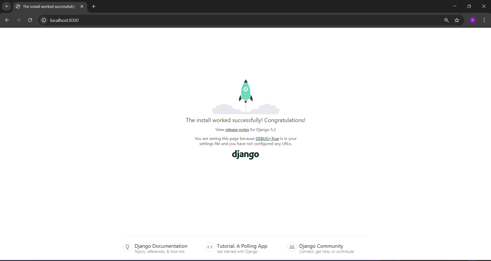
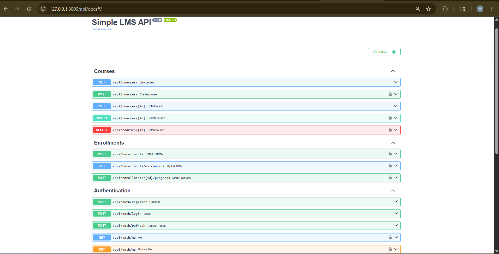
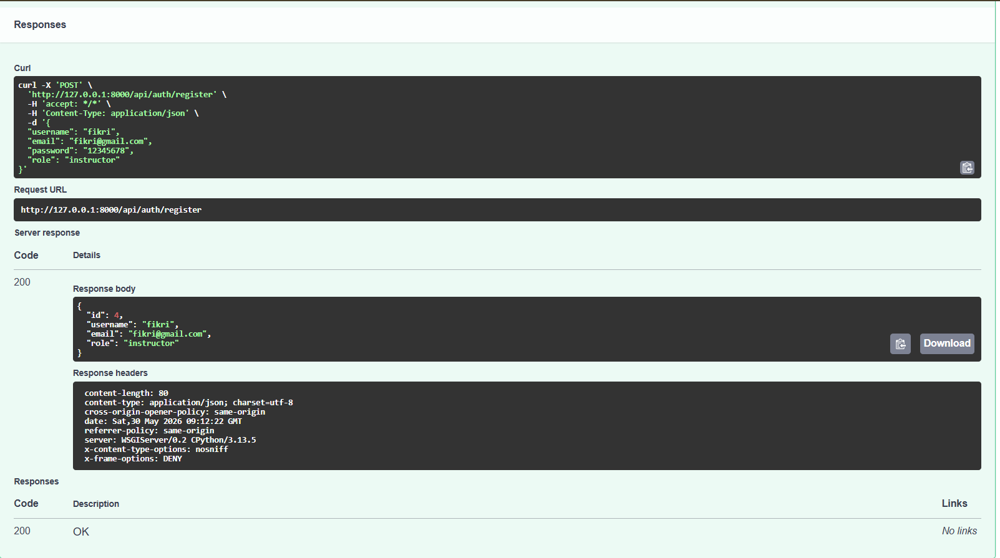
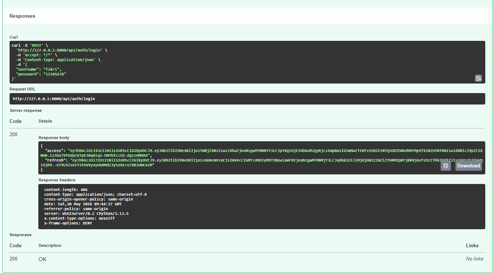

# Simple LMS - Django Docker Setup

Project ini merupakan setup environment development untuk aplikasi Simple LMS menggunakan Django, Docker, dan PostgreSQL sebagai database.

Project ini bertujuan untuk mempermudah proses development dengan environment yang konsisten menggunakan container Docker.

## Cara Menjalankan Project

1. Build Docker Image

```bash
docker compose build
```

2. Jalankan Container

```bash
docker compose up
```

3. Jalankan Migration Database

Buka terminal baru lalu jalankan:

```bash
docker compose exec web python manage.py migrate
```

4. Akses Aplikasi

Buka browser dan masuk ke:

```
http://localhost:8000
```

Jika berhasil maka halaman Django akan tampil.

---

## Environment Variables Explanation

Project ini menggunakan environment variables untuk konfigurasi database PostgreSQL.

Contoh isi file `.env.example`:

```
POSTGRES_DB=lms_db
POSTGRES_USER=lms_user
POSTGRES_PASSWORD=lms_password
POSTGRES_HOST=db
POSTGRES_PORT=5432
```

Penjelasan Variabel

| Variable          | Deskripsi                |
| ----------------- | ------------------------ |
| POSTGRES_DB       | Nama database PostgreSQL |
| POSTGRES_USER     | Username PostgreSQL      |
| POSTGRES_PASSWORD | Password PostgreSQL      |
| POSTGRES_HOST     | Host database container  |
| POSTGRES_PORT     | Port PostgreSQL          |


Environment variables ini digunakan oleh Django untuk melakukan koneksi ke database PostgreSQL yang berjalan di dalam Docker container.

---

## Screenshot Django Welcome Page

Berikut tampilan halaman awal Django setelah project berhasil dijalankan:



Halaman ini dapat diakses melalui:
http://localhost:8000

Jika halaman tersebut muncul, berarti:

- Docker container berjalan dengan baik
- Django berhasil dijalankan
- Koneksi PostgreSQL berhasil

---

## Data Models

Project Simple LMS ini mengimplementasikan beberapa model utama:

*User*
- Memiliki role: admin, instructor, student
- Digunakan sebagai instructor dan student dalam sistem LMS

*Category*
- Mendukung hierarchical category (self-referencing)
- Digunakan untuk mengelompokkan course

*Course*
- Relasi ke Instructor (User)
- Relasi ke Category
- Memiliki banyak Lesson

*Lesson*
- Relasi ke Course
- Memiliki field ordering untuk menentukan urutan materi

*Enrollment*
- Relasi Student ke Course
- Memiliki unique constraint untuk mencegah student enroll course yang sama dua kali

*Progress*
- Tracking penyelesaian Lesson oleh Student
- Digunakan untuk monitoring progress pembelajaran

---

## Query Optimization

Untuk meningkatkan performa aplikasi, dilakukan Query Optimization untuk menghindari N+1 Query Problem.

### 🔴 Sebelum Optimasi (N+1 Problem)

Query dijalankan tanpa optimasi:

N+1 Query Count: 2

Query tambahan terjadi karena Django melakukan query terpisah untuk setiap relasi instructor.

### 🟢 Setelah Optimasi

Menggunakan Query Optimization:

Optimized Query Count: 1

Jumlah query berkurang menjadi satu query saja.

### Teknik yang Digunakan
- select_related() → untuk relasi ForeignKey
- prefetch_related() → untuk relasi banyak data (multiple objects)

Optimasi ini mengurangi jumlah query secara signifikan dan meningkatkan performa aplikasi dengan menghindari N+1 Query Problem.

---

## Django Admin Features

Fitur Django Admin yang diimplementasikan:

- List display yang informatif
- Search dan filter functionality
- Inline Lesson pada Course
- Manajemen data:
    - User
    - Category
    - Course
    - Enrollment
    - Progress
---

# Progress 3: Simple LMS - REST API & JWT Authentication

Pada progress ini, aplikasi Simple LMS dikembangkan menjadi REST API menggunakan Django Ninja. Fokus utama pengembangan adalah implementasi JWT Authentication, validasi data menggunakan Pydantic Schema, serta pembatasan akses berdasarkan role pengguna Role-Based Access Control (RBAC)(RBAC).

## Fitur yang Diimplementasikan

### Authentication System (JWT)

- Registrasi user baru berdasarkan role.
- Login menggunakan Access Token dan Refresh Token.
- Endpoint profil pengguna (/auth/me).
- Update profil pengguna.

### Role-Based Access Control (RBAC)

- Implementasi hak akses berdasarkan role:
  - Admin
  - Instructor
  - Student
- Proteksi endpoint sesuai role pengguna.

### Course Management

- Menampilkan daftar course dengan pagination dan filtering.
- Instructor dapat membuat dan mengubah course miliknya.
- Admin dapat menghapus course.

### Enrollment & Progress Tracking

- Student dapat melakukan enrollment course.
- Menampilkan course yang diikuti.
- Menandai lesson sebagai selesai (completed).

### API Documentation

- Dokumentasi API otomatis menggunakan Swagger UI.
- Pengujian endpoint langsung melalui browser.

## Cara Menjalankan API

### 1. Pastikan migrasi database sudah dijalankan:

```bash
python manage.py makemigrations
python manage.py migrate
```

### 2. Menjalankan Server

```bash
python manage.py runserver
```

Server akan berjalan pada:

```text
http://127.0.0.1:8000
```

### 3. Mengakses Dokumentasi API

Swagger UI tersedia pada:

```text
http://127.0.0.1:8000/api/docs
```


### 4. Register


 
### 5. Login



### 6. Postman Collection


---
